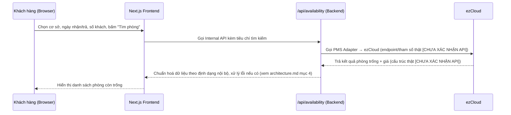
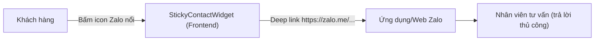

# API Integration Design — Túi Ba Gang Website

**Phase 3.** Bao gồm: API Architecture nội bộ, ezCloud, Zalo OA, Chatbot, n8n. **CHƯA CODE.**

## 0. Nguyên tắc bắt buộc (CLAUDE.md mục 3)

> Không được tự tạo hoặc đoán: API endpoint, Request parameter, Response structure, Authentication method, Permission. Nếu chưa có API documentation chính thức, phải đánh dấu là **[CHƯA XÁC NHẬN API]**.

Toàn bộ tài liệu này tuân thủ nghiêm ngặt nguyên tắc trên. Mọi chỗ liên quan ezCloud đều được chia rõ 3 nhóm: **Đã xác nhận / Cần có / Chưa xác nhận**, theo đúng yêu cầu của Phase 3.

---

## 1. API Architecture (Internal API — do chính chúng ta thiết kế, không phụ thuộc ezCloud)

Đây là các API route **nằm trong Backend của chính website** (`app/api/...`), do chúng ta tự quyết định request/response — khác hẳn với API của ezCloud (bên ngoài, chưa xác nhận). Frontend chỉ gọi các API nội bộ này.

| Internal endpoint (đề xuất) | Method | Mục đích | Nguồn dữ liệu bên trong |
|---|---|---|---|
| `/api/availability` | `GET`/`POST` | Nhận tiêu chí tìm phòng (cơ sở, ngày nhận/trả, số khách) → trả danh sách phòng trống + giá | ezCloud, qua PMS Adapter (mục 3) |
| `/api/rooms/[hotel]` | `GET` | Trả danh sách hạng phòng tĩnh (mô tả, ảnh, diện tích) theo cơ sở | Nội dung tĩnh trong repo (không cần ezCloud nếu mô tả phòng không đổi theo thời gian thực) |
| `/api/offers` | `GET` | Trả danh sách ưu đãi hiện có | Nội dung tĩnh trong repo — **[CHƯA XÁC ĐỊNH]** có đồng bộ ezCloud không (Open Question F7) |

**Nguyên tắc thiết kế response chung:** mọi API nội bộ trả JSON theo 1 khuôn dạng thống nhất (dữ liệu thành công hoặc lỗi có cấu trúc rõ ràng — chi tiết field cụ thể sẽ chốt ở giai đoạn code, không thuộc phạm vi tài liệu thiết kế này). Không thiết kế thêm endpoint nào ngoài bảng trên ở giai đoạn hiện tại — các luồng đặt phòng/hủy/đổi phòng (`/api/booking`, `/api/booking/cancel`...) **chưa được thiết kế cụ thể** vì cơ chế đặt phòng thật (Flow D) vẫn **[CHƯA XÁC ĐỊNH]** (xem `user-flows.md`, Open Question F5/F6).

---

## 2. EZCloud Integration

### 2.1 Đã xác nhận

| Nội dung | Nguồn |
|---|---|
| Khách sạn **có sử dụng ezCloud** làm PMS/Booking Engine | File B, trang 1: *"Liên kết với ezCloud để kiểm tra phòng thực tế tại thời điểm tìm kiếm"* |
| ezCloud là nguồn dữ liệu cho **availability (tình trạng phòng còn trống)** khi khách tìm phòng | File B, trang 1 |

Ngoài 2 điểm trên, **không có bất kỳ thông tin kỹ thuật nào khác** (không có tài liệu API, không có endpoint, không có mẫu request/response, không có thông tin xác thực) trong File A hoặc File B.

### 2.2 Cần có (business requirement cần, nhưng chưa có tài liệu API để biết cách gọi)

Đây là những chức năng mà **nghiệp vụ đặt phòng chắc chắn cần**, dựa trên `functional-requirements.md` mục 5 (Booking) — nhưng cách gọi thật sự tới ezCloud đều **[CHƯA XÁC NHẬN API]**:

| Chức năng cần có | Ghi chú |
|---|---|
| Get room information (lấy thông tin hạng phòng) | Cần để hiển thị `/phong-nghi/:hotel` nếu danh sách phòng lấy động thay vì tĩnh |
| Get room availability (lấy tình trạng phòng trống) | CONFIRMED có yêu cầu (mục 2.1), nhưng cơ chế gọi **[CHƯA XÁC NHẬN API]** |
| Get price (lấy giá phòng) | File B không hiển thị giá ở bất kỳ mockup nào — cần có để hoàn thiện luồng tìm phòng, nhưng **[CHƯA XÁC NHẬN API]** |
| Create booking (tạo đặt phòng) | Cần để hoàn tất Flow D, nhưng mô hình (redirect/nhúng widget/gọi API tạo booking trực tiếp) **[CHƯA XÁC ĐỊNH]** — xem Open Question F5 |
| Cancel booking (hủy đặt phòng) | User Flow E ghi nhận là **[CHƯA XÁC ĐỊNH]** toàn bộ — File B không có mockup |
| Change booking (thay đổi đặt phòng) | Tương tự Cancel booking — **[CHƯA XÁC ĐỊNH]** |

### 2.3 Chưa xác nhận (liệt kê rõ để tránh tự đoán)

**[CHƯA XÁC NHẬN API]** cho toàn bộ các mục sau — KHÔNG được tự tạo giá trị giả định khi vào giai đoạn code:

- Base URL / endpoint thật của ezCloud API (hoặc URL widget nhúng nếu ezCloud cung cấp giao diện có sẵn)
- Phương thức xác thực (API Key? OAuth2? Basic Auth? IP whitelist?)
- Cấu trúc request để tìm phòng trống (tên tham số ngày nhận/trả, số khách, mã cơ sở...)
- Cấu trúc response (tên field, đơn vị tiền tệ, mã lỗi...)
- Có 1 tài khoản ezCloud dùng chung cho cả 3 cơ sở hay 3 tài khoản riêng (Open Question F6) — ảnh hưởng trực tiếp tới thiết kế Adapter (mục 3 dưới)
- ezCloud có xử lý thanh toán không, hay chỉ quản lý phòng/giá
- ezCloud có webhook thông báo khi có booking mới/hủy không

### 2.4 Thiết kế PMS Adapter (chuẩn bị sẵn kiến trúc, chờ tài liệu thật)

Vì chưa có tài liệu, chúng ta **không viết phần gọi ezCloud thật**, mà chỉ định nghĩa trước "hợp đồng" (những hàm mà Backend cần) — khi có tài liệu chính thức, đội kỹ thuật chỉ cần lấp đầy phần triển khai bên trong, không phải sửa Frontend hay các phần khác:

```
PmsAdapter (khái niệm — chưa phải code thật)
├── getRoomAvailability(hotelId, checkIn, checkOut, guests) → [CHƯA XÁC NHẬN API]
├── getRoomPrice(hotelId, roomTypeId, checkIn, checkOut)    → [CHƯA XÁC NHẬN API]
├── createBooking(bookingInfo)                               → [CHƯA XÁC NHẬN API]
├── cancelBooking(bookingReference)                          → [CHƯA XÁC NHẬN API]
└── changeBooking(bookingReference, newDetails)              → [CHƯA XÁC NHẬN API]
```

Lợi ích: (1) Frontend và các phần khác của Backend chỉ cần biết "hợp đồng" này, không cần biết chi tiết ezCloud; (2) nếu sau này đổi PMS khác (không dùng ezCloud nữa), chỉ cần viết Adapter mới theo đúng hợp đồng, không phải sửa lại toàn bộ hệ thống — đúng nguyên tắc "component có thể tái sử dụng, không over-engineering" trong `CLAUDE.md` mục 5.

### 2.5 Sequence diagram — luồng tìm phòng (Flow C, ở mức khái niệm)



---

## 3. Zalo OA Integration

### Hiện trạng CONFIRMED — mức tối thiểu

- File B, trang 1: có nút Zalo nổi (`StickyContactWidget`) ở trang chủ, dùng để khách "tư vấn" trực tiếp.
- Đây là **link chat Zalo thông thường** (dạng `https://zalo.me/<số điện thoại hoặc OA ID>`), **KHÔNG có bằng chứng** cho tích hợp Zalo OA API tự động (gửi thông báo booking, chatbot trả lời tự động...).

### Kiến trúc tương ứng

Vì chỉ là 1 đường link mở ứng dụng/web Zalo, **không cần Backend, không cần Authentication, không cần API integration nào** — đây là hành vi hoàn toàn phía Frontend (client-side link), khách bấm vào là rời khỏi luồng của website để chat trực tiếp với nhân viên qua Zalo.



### Zalo OA API đầy đủ (tự động hoá) — KHÔNG triển khai ở giai đoạn hiện tại

Nếu sau này chủ đầu tư muốn nâng cấp lên (ví dụ: tự động gửi tin nhắn xác nhận booking qua Zalo OA), đó là một tích hợp khác hẳn về độ phức tạp: cần đăng ký Zalo Official Account, xin quyền gửi tin nhắn (Zalo OA API), xác thực OAuth, và có endpoint riêng ở Backend để gọi Zalo OA API khi có booking mới. **Đây KHÔNG phải yêu cầu hiện tại** (không có căn cứ trong File A/File B — xem Assumption A10 trong `assumptions.md`), nên **không thiết kế chi tiết**, chỉ ghi nhận là hướng mở rộng khả dĩ trong tương lai nếu được yêu cầu chính thức.

---

## 4. Chatbot — KHÔNG THIẾT KẾ

**Kết luận:** Không có bất kỳ mockup, chú thích, hay đề cập nào về chatbot trong File A (54 trang) hoặc File B (10 trang) — đã rà soát toàn bộ 2 tài liệu (bao gồm tìm kiếm từ khoá "chatbot" trong toàn văn, không có kết quả). Theo `CLAUDE.md` mục 2 ("Không được tự ý thêm hoặc thay đổi business requirement"), **không thiết kế kiến trúc chatbot** ở Phase 3 này.

Nếu trong tương lai có yêu cầu chatbot chính thức (ví dụ: chatbot trả lời câu hỏi thường gặp, hoặc chatbot trong Zalo OA), cần bổ sung Open Question riêng và thực hiện lại quy trình phân tích requirement trước khi thiết kế kiến trúc.

## 5. n8n — KHÔNG CÓ CĂN CỨ ĐỂ SỬ DỤNG Ở GIAI ĐOẠN HIỆN TẠI

**Kết luận:** File A/File B không đề cập bất kỳ nhu cầu tự động hoá quy trình (workflow automation) nào cần n8n (ví dụ: đồng bộ dữ liệu định kỳ, tự động gửi email hàng loạt, nối nhiều hệ thống với nhau). Với kiến trúc hiện tại (1 Frontend + BFF + ezCloud), **chưa có nhu cầu kỹ thuật nào bắt buộc phải dùng n8n**.

**Ghi chú tương lai (không phải quyết định hiện tại):** n8n *có thể* hữu ích về sau nếu phát sinh nhu cầu như "tự động đồng bộ ưu đãi giữa ezCloud và website" hoặc "tự động gửi email/Zalo khi có booking mới" — nhưng đây thuần tuý là gợi ý mang tính tham khảo, **không đưa vào kiến trúc chính thức** cho đến khi có yêu cầu nghiệp vụ cụ thể xác nhận.

---

*Xem thêm: `architecture.md` (kiến trúc tổng thể), `security.md` (bảo mật cho các API này), `environment-variables.md` (biến môi trường cần cho tích hợp ezCloud).*
