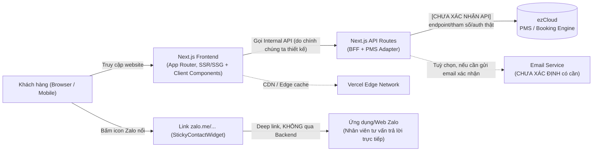

# Technical Architecture — Túi Ba Gang Website

**Phase 3 — Thiết kế Technical Architecture.** Tài liệu này đề xuất kiến trúc kỹ thuật production-ready, dựa trên toàn bộ requirement đã xác nhận ở Phase 1 & Phase 2. **CHƯA CODE** — đây thuần tuý là tài liệu thiết kế.

## 0. Nguồn tài liệu & nguyên tắc

- Đã đọc lại: `docs/requirements-analysis.md`, `docs/functional-requirements.md`, `docs/non-functional-requirements.md`, `docs/sitemap.md`, `docs/user-flows.md`, `docs/integrations.md`, `docs/data-model.md`, `docs/open-questions.md`.
- **Lưu ý:** đường dẫn `requirements/hotel-requirement.pdf` được yêu cầu đọc nhưng **không tồn tại** trong môi trường làm việc (đã kiểm tra lại). Nguồn requirement thật vẫn là 2 file đã dùng xuyên suốt Phase 1–2: File A (`TUI BA GANG CONCEPT. CẬP NHẬT.pdf`) và File B (`GIAO DIỆN WEB TÚI BA GANG.pdf`). Toàn bộ kiến trúc dưới đây được suy ra từ 2 file này + các file `docs/*.md` đã CONFIRMED, không thêm giả định ngoài phạm vi.
- Tuân thủ `CLAUDE.md`: không đoán API/endpoint của ezCloud, không hard-code secret, ưu tiên đơn giản/tái sử dụng, không tự ý thêm kiến trúc/tính năng ngoài requirement (ví dụ: không thiết kế chatbot vì không có căn cứ — xem `api-integration-design.md` mục 5–6).
- Quy ước ký hiệu giữ nguyên từ Phase 1–2: **CONFIRMED**, **[CHƯA XÁC ĐỊNH]**, **[CHƯA XÁC NHẬN API]**, **ĐỀ XUẤT (cần xác nhận)**.

---

## 1. Kiến trúc tổng thể (Overview)



Giải thích ngắn gọn (không cần biết backend chuyên sâu):

- **Frontend** là phần khách hàng nhìn thấy và bấm vào (trang chủ, trang phòng, trang đặt phòng...). Chạy trên Next.js.
- **Backend (API Routes)** là "người trung gian" chạy trên server của chính website, đứng giữa Frontend và ezCloud. Frontend **không bao giờ gọi thẳng ezCloud** — mọi thứ đi qua Backend trước. Lý do giải thích ở mục 4.
- **ezCloud** là hệ thống của bên thứ ba (PMS/Booking Engine) mà khách sạn đang dùng thật — cung cấp dữ liệu phòng trống/giá.
- **Zalo** hiện tại chỉ là 1 đường link mở ứng dụng Zalo, khách hàng chat trực tiếp với nhân viên — **không đi qua Backend, không phải một "hệ thống tích hợp"** theo nghĩa kỹ thuật (xem `api-integration-design.md` mục 4).

---

## 2. Frontend Architecture

### 2.1 Công nghệ

| Hạng mục | Lựa chọn | Lý do |
|---|---|---|
| Framework | **Next.js (App Router)** | Đã chọn từ Phase 0; App Router hỗ trợ tốt Server Components (giảm JS gửi về trình duyệt → tốt cho Performance, vốn là mối lo đã ghi trong `non-functional-requirements.md` do có tới 3 "website con"), hỗ trợ tốt SEO/metadata theo trang, dễ tổ chức route theo `sitemap.md`. |
| Ngôn ngữ | **TypeScript** | Giảm lỗi runtime, tự mô tả kiểu dữ liệu cho các entity đã định nghĩa ở `data-model.md` (Property, RoomType, Offer...) — quan trọng vì dữ liệu ezCloud sau này có cấu trúc phức tạp, cần kiểu rõ ràng để tránh sai sót khi map dữ liệu. |
| CSS | **Tailwind CSS** | Đã chọn từ Phase 0; phù hợp với việc mỗi cơ sở (Central/Ember Style/Little Bay) có tông màu hơi khác nhau (Open Question F trong `open-questions.md`) — dễ áp dụng theme/token riêng qua config mà không cần viết lại CSS. |
| Animation | **Framer Motion — chỉ dùng khi thật sự cần** | Xem mục 2.4. |

### 2.2 Cấu trúc thư mục đề xuất (khái niệm — chưa tạo code)

```
app/
├── [locale]/                      # vi | en — xem mục 8 (Đa ngôn ngữ)
│   ├── page.tsx                   # / (Trang chủ)
│   ├── ve-chung-toi/page.tsx
│   ├── phong-nghi/
│   │   ├── page.tsx                        # chọn cơ sở
│   │   └── [hotel]/
│   │       ├── page.tsx                    # danh sách hạng phòng
│   │       └── [roomSlug]/page.tsx         # chi tiết phòng
│   ├── trai-nghiem/page.tsx
│   ├── thu-vien/
│   │   ├── page.tsx
│   │   └── [hotel]/page.tsx                # landing page riêng từng cơ sở
│   ├── uu-dai/page.tsx
│   ├── lien-he/page.tsx
│   ├── dat-phong/page.tsx
│   ├── chinh-sach/page.tsx
│   └── cau-hoi-thuong-gap/page.tsx
├── api/                            # Backend — xem mục 3
│   └── ...
components/
├── layout/        # Header, Footer, PropertySubNav, StickyContactWidget, LanguageSwitcher
├── sections/       # Hero, PropertySelector, ...
├── cards/          # PropertyCard, RoomCard, OfferCard, ContactCard, ExperienceCard
├── booking/        # BookingSearchBar, RoomAvailabilityList, ...
└── ui/             # Button, Modal, Toast, DatePicker, GuestCountSelector (dùng chung)
lib/
├── pms/            # PMS Adapter cho ezCloud — xem api-integration-design.md
├── i18n/
└── content/        # nội dung tĩnh theo locale (JSON/MD) — xem mục 8
```

Cấu trúc này bám sát 1-1 vào `sitemap.md` (không thêm route nào ngoài sitemap đã CONFIRMED) và `component-inventory.md` (mỗi component trong bảng đã liệt kê ở Phase 2 có 1 vị trí rõ ràng ở đây).

### 2.3 Chiến lược render theo từng nhóm trang

| Nhóm trang | Chiến lược | Lý do |
|---|---|---|
| Trang nội dung tĩnh: `/`, `/ve-chung-toi`, `/trai-nghiem`, `/thu-vien/:hotel`, `/uu-dai`, `/lien-he`, `/chinh-sach`, `/cau-hoi-thuong-gap` | **Static Generation + revalidate định kỳ (ISR)** | Nội dung không đổi theo từng khách xem — tối ưu tốc độ tải, giảm tải server. Revalidate (làm mới định kỳ) để khi nội dung ưu đãi/giá cập nhật thì không cần deploy lại. |
| Danh sách/chi tiết phòng: `/phong-nghi/:hotel`, `/phong-nghi/:hotel/:roomSlug` | **Static + ISR cho phần mô tả phòng; phần giá/availability (nếu có) tải phía client (client-side fetch)** | Mô tả/ảnh phòng ít đổi (Static tốt cho SEO); nhưng nếu sau này giá/tình trạng phòng lấy động từ ezCloud thì phần đó phải luôn mới — không thể cache lâu (xem mục 7 — Caching). |
| `/dat-phong` (tìm & đặt phòng) | **Client-side rendering (CSR) cho phần tương tác (form tìm phòng, kết quả)** | Đây là khu vực tương tác nhiều, dữ liệu theo thời gian thực, không phù hợp cache tĩnh. |

### 2.4 Framer Motion — nguyên tắc "chỉ dùng khi thật sự cần"

Vì `non-functional-requirements.md` đã cảnh báo Performance là mối lo lớn (3 trang "Thư viện" nhiều ảnh hero × 2 ngôn ngữ), Framer Motion **không dùng tràn lan**. Đề xuất giới hạn phạm vi dùng:

- **Nên dùng:** hiệu ứng fade-in nhẹ cho Hero khi vào trang, chuyển tab mượt ở `PropertySubNav` (thanh điều hướng phụ trong `/thu-vien/:hotel`), mở/đóng `Modal`, chuyển ảnh trong `RoomGallery`.
- **Không nên dùng:** animation phức tạp/scroll-triggered nặng trên toàn trang, animation cho danh sách dài (`RoomCard`, `OfferCard` grid) vì ảnh hưởng tốc độ render khi có nhiều phần tử.
- Đây là **ĐỀ XUẤT kỹ thuật**, không phải requirement — vì File A/File B không có yêu cầu cụ thể về animation.

---

## 3. Backend Architecture

### 3.1 Vai trò: Backend-for-Frontend (BFF)

**BFF (Backend For Frontend)** là một lớp backend nhỏ, viết riêng cho nhu cầu của chính website này (giải thích đơn giản: thay vì Frontend gọi thẳng ezCloud, Frontend gọi vào Backend do chính chúng ta viết, Backend đó mới đi gọi ezCloud). Next.js API Routes (Route Handlers trong thư mục `app/api/`) đóng vai trò BFF này.

**Lý do bắt buộc phải có lớp BFF này** (không phải tuỳ chọn):

1. **Bảo mật:** Nếu ezCloud yêu cầu API Key/secret để gọi, secret đó **tuyệt đối không được đặt ở Frontend** (vì mã nguồn Frontend chạy trên trình duyệt của khách, ai cũng xem được) — theo đúng `CLAUDE.md` mục 4. Secret chỉ được giữ ở Backend (server), theo `environment-variables.md`.
2. **Cách ly rủi ro khi chưa có tài liệu API ezCloud:** Vì chưa biết chính xác định dạng dữ liệu ezCloud trả về, Backend đóng vai trò "chuẩn hoá" dữ liệu trước khi trả cho Frontend — nếu sau này ezCloud đổi cấu trúc, chỉ cần sửa ở Backend, Frontend không bị ảnh hưởng.
3. **Kiểm soát tần suất gọi & cache** (mục 7) — tránh gọi ezCloud quá nhiều lần không cần thiết.

### 3.2 PMS Adapter Pattern (thiết kế để "chờ" tài liệu ezCloud)

Vì **chưa có tài liệu API ezCloud chính thức**, Backend được thiết kế theo nguyên tắc **Adapter (lớp chuyển đổi)**: định nghĩa trước một "hợp đồng nội bộ" (interface) mô tả những gì Backend *cần* từ ezCloud (ví dụ: `getAvailability(...)`, `getRoomInfo(...)`), nhưng **phần triển khai thật sự gọi ezCloud để trong ngoặc chờ xác nhận**. Khi có tài liệu API chính thức, chỉ cần viết phần triển khai bên trong Adapter — không phải sửa lại toàn bộ Frontend/Backend. Chi tiết đầy đủ ở `api-integration-design.md` mục 3.

### 3.3 Danh sách module Backend dự kiến

| Module | Chức năng | Nguồn dữ liệu |
|---|---|---|
| `pms/adapter` | Lớp trừu tượng gọi ezCloud (availability, giá, tạo booking...) | ezCloud — **[CHƯA XÁC NHẬN API]** |
| `api/availability` | Nhận tiêu chí tìm phòng từ Frontend, gọi `pms/adapter`, trả kết quả đã chuẩn hoá | ezCloud (qua adapter) |
| `content` (không phải API route, chỉ là lớp đọc dữ liệu tĩnh) | Đọc nội dung tĩnh theo locale (câu chuyện thương hiệu, ưu đãi, liên hệ...) | File nội dung tĩnh (JSON/MD) trong repo — không cần database vì chưa xác nhận có CMS (F13 trong `open-questions.md`) |

**Không thiết kế thêm module nào khác** ở giai đoạn này (ví dụ: không có module "booking cancellation", "payment" vì các luồng này vẫn **[CHƯA XÁC ĐỊNH]** theo `user-flows.md` Flow D/E — sẽ bổ sung khi có câu trả lời).

---

## 4. Xử lý lỗi (Error handling)

| Tình huống | Cách xử lý đề xuất |
|---|---|
| ezCloud không phản hồi/timeout khi tìm phòng | Backend trả về lỗi có cấu trúc rõ ràng (mã lỗi + thông điệp), Frontend hiển thị thông báo thân thiện bằng VI/EN kèm gợi ý "vui lòng gọi hotline [số của cơ sở]" — tận dụng dữ liệu liên hệ đã CONFIRMED. **Không để trắng trang hoặc lỗi kỹ thuật khó hiểu hiển thị cho khách.** |
| Dữ liệu ezCloud trả về sai định dạng dự kiến | Backend validate dữ liệu trước khi trả cho Frontend (dùng thư viện validate như `zod`); nếu sai, log lỗi (mục 5) và trả thông báo lỗi chung, không để lỗi kỹ thuật rò rỉ ra Frontend. |
| Lỗi phía Frontend (route không tồn tại, lỗi render) | Dùng cơ chế chuẩn của Next.js App Router: file `not-found.tsx` (404 theo từng locale) và `error.tsx` (bắt lỗi runtime) ở từng nhóm route. |
| Người dùng nhập sai định dạng ở form tìm phòng | Validate ngay ở Frontend (client-side) trước khi gọi Backend, tránh gọi API không cần thiết. |

## 5. Logging (ĐỀ XUẤT — không phải requirement, nhưng cần thiết cho vận hành)

- Log tập trung ở Backend (API Routes) — mỗi lần gọi ezCloud ghi lại: thời gian, endpoint gọi (ẩn phần secret), thời gian phản hồi, thành công/thất bại. **Không log dữ liệu cá nhân khách hàng (tên, email, số điện thoại) dưới dạng rõ ràng** nếu chưa có yêu cầu về chính sách bảo mật dữ liệu (liên quan `non-functional-requirements.md` — Security vẫn [CHƯA XÁC ĐỊNH]).
- Giai đoạn đầu có thể dùng log mặc định của Vercel (xem được qua Vercel Dashboard) — đủ dùng cho quy mô hiện tại, không cần thêm dịch vụ logging trả phí ngay từ đầu (tránh over-engineering theo `CLAUDE.md` mục 5).
- Nếu sau này cần theo dõi lỗi chi tiết hơn, có thể cân nhắc thêm công cụ giám sát lỗi (error monitoring) — đây là **đề xuất tương lai, chưa cần triển khai ngay.**

## 6. Caching

| Loại dữ liệu | Chiến lược cache | Lý do |
|---|---|---|
| Nội dung tĩnh (câu chuyện thương hiệu, trang Về chúng tôi, Trải nghiệm...) | Cache dài hạn + ISR (làm mới định kỳ, ví dụ mỗi vài giờ) | Nội dung ít đổi. |
| Ảnh (đặc biệt ảnh hero của 3 trang Thư viện) | Cache dài hạn qua CDN của Vercel + `next/image` tự tối ưu định dạng/kích thước | Giảm tải, giải quyết đúng mối lo Performance đã ghi trong `non-functional-requirements.md`. |
| Danh sách ưu đãi (`/uu-dai`) | Cache ngắn/trung hạn + ISR | Có thể thay đổi theo thời gian áp dụng khuyến mãi, nhưng không cần real-time. |
| Kết quả tìm phòng/giá/availability từ ezCloud | **Không cache lâu, hoặc cache rất ngắn (vài chục giây)** | Đây là dữ liệu cần chính xác theo thời gian thực — cache sai sẽ khiến khách thấy phòng còn trống trong khi thực tế đã hết. |

## 7. SEO

- Dùng **Next.js Metadata API** để khai báo `title`/`description`/Open Graph riêng cho từng trang, theo từng locale.
- **Mỗi cơ sở cần chiến lược từ khoá riêng** như đã ghi trong `non-functional-requirements.md` (ví dụ: Central → "khách sạn trung tâm Đà Lạt", Little Bay → "villa Đà Lạt gần rừng thông") — áp dụng cho trang `/thu-vien/:hotel` vì đây là landing page đầy đủ nhất của từng cơ sở.
- Sinh `sitemap.xml` và `robots.txt` tự động từ cấu trúc route (Next.js hỗ trợ sẵn cơ chế này).
- **[CHƯA XÁC ĐỊNH]**: từ khoá SEO cụ thể, mô tả meta cho từng trang — cần nội dung marketing xác nhận, không tự viết thay.

## 8. Đa ngôn ngữ (Multilingual)

- Route theo locale dạng `/vi/...` và `/en/...` (dùng segment `[locale]` trong App Router), có middleware phát hiện ngôn ngữ trình duyệt để redirect lần đầu, sau đó ghi nhớ lựa chọn của khách (qua cookie).
- ~~Nội dung dịch được tổ chức theo file JSON/Markdown theo từng locale~~ → **Phase 9:** toàn bộ text theo ngôn ngữ nằm trong `lib/i18n/dictionaries/vi.ts` và `en.ts`; `lib/content` chỉ giữ dữ liệu không phụ thuộc ngôn ngữ (xem `docs/technical-decisions.md` #8). Vẫn **chưa có CMS** (F13) — nếu sau này có CMS, chỉ cần thay nguồn đọc nội dung trong `lib/content`, không đổi kiến trúc Frontend.
- `LanguageSwitcher` (đã có trong `component-inventory.md`) chuyển giữa 2 locale, giữ nguyên trang đang xem.

## 9. Responsive

- Tailwind CSS mobile-first: thiết kế cho mobile trước, mở rộng dần lên tablet/desktop.
- File B chỉ có mockup desktop (đã ghi trong `non-functional-requirements.md`), nên bố cục mobile là **ĐỀ XUẤT của đội kỹ thuật dựa trên bố cục desktop đã có**, cần xác nhận lại với đơn vị thiết kế trước khi hoàn thiện chi tiết responsive.

## 10. Deployment

- **Vercel** (đã quyết định từ Phase 0), kết nối trực tiếp với repository GitHub.
- **CI/CD tự động:** mỗi lần đẩy code lên nhánh chính → tự động deploy Production; mỗi Pull Request → tự động tạo Preview Deployment riêng để review trước khi merge.
- **Biến môi trường** khai báo riêng theo từng môi trường (Development / Preview / Production) trong Vercel Dashboard — không commit vào Git (chi tiết ở `environment-variables.md`).
- Domain chính thức: nghi là `tuibagangdalat.vn` (Assumption A9) — **[CHƯA XÁC ĐỊNH chính thức]**, cần xác nhận trước khi trỏ domain thật.

---

*Chi tiết API/ezCloud/Zalo/Chatbot/n8n: xem `api-integration-design.md`. Chi tiết bảo mật/authentication/authorization: xem `security.md`. Danh sách biến môi trường: xem `environment-variables.md`. Lý do lựa chọn kiến trúc: xem `technical-decisions.md`.*
